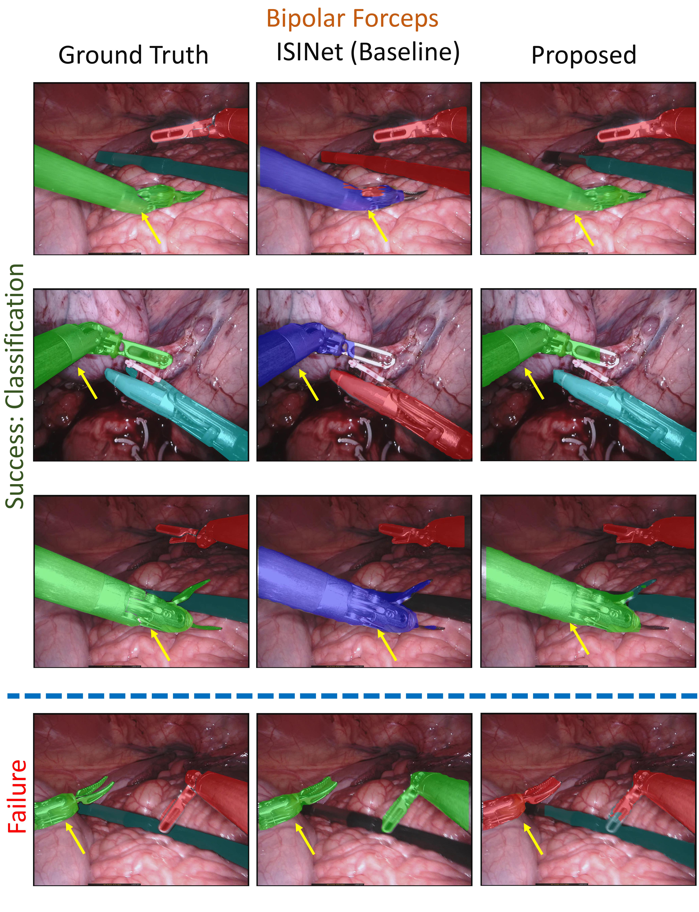

S3NET: A Three Stage Deep Neural Network Model for 
Highly Accurate Instance Segmentation of Surgical Instruments
===========================================

Overview
--------
Computer-assisted medical surgeries require accurate instance segmentation of surgical instruments in the endoscopic camera view to carry out many downstream perception and control tasks.
We observe that, due to the typical orientation and aspect ratio of medical instruments, the cross-domain fine-tuning of the instance segmentation model detects and segments the object regions correctly but is insufficient to classify the segmented regions accurately. 
We propose using cumulative IoU over the entire test dataset as the evaluation metric. Using cumulative IoU provides many insights about the low performance of state-of-the-art instance segmentation techniques on the dataset.
We propose a novel three-stage deep neural network architecture to augment a third stage in a standard instance segmentation pipeline to perform mask-based classification of the segmented object. To handle small datasets with visually similar classes, we train the proposed third stage using ideas from metric learning.
Read more: Paper[https://www.cse.iitd.ac.in/~britty/papers/S3Net_WACV_2022_manuscipt.pdf]

Data
----
EndoVis 2017 consisting of 8 X 225-frame sequences is used as train set and 2 X 300-frame sequences is used as test set.
Instrument labels are 
Bipolar Forceps 
Prograsp Forceps
Large Needle Driver
Vessel Sealer
Grasping Retractor
Monopolar Curved Scissors 
Ultrasound Probe

Method
------
S3NET
The basic S3NET pipeline is divided into two:
1) Stage_1_2
3) Stage 3

These two are set on different environments:

Installation: Stage_1_2
------------
To install you can run
(Tested on Ubuntu 16.04. For Ubuntu 18 and 20, install gcc 9)

* conda create -n S3NET_Stage_1_2 python=3.7
* conda activate S3NET_Stage_1_2
* conda install pytorch==1.1.0 torchvision==0.3.0 cudatoolkit=9.2 -c pytorch
* conda install cython
* pip install "git+https://github.com/philferriere/cocoapi.git#egg=pycocotools&subdirectory=PythonAPI"
* pip install mmcv==0.2.14
* pip install tqdm
* pip install opencv-python
* pip install scikit-image
* git clone https://github.com/S3NET/A_Three_Stage_Deep_Neural_Network_for_Highly_Accuracte_Surgical_Instrument_Segmentation.git S3NET
* cd S3NET
* bash compile.sh
* python setup.py install
* pip install .

Installation: Stage 3
------------
To install you can run
(Tested on Ubuntu 16.04. For Ubuntu 18 and 20, install gcc 9)
Dependecies:
Nvidia Driver >= 460
CUDA == 11.2
Cudnn == 8.1

* conda create -n S3NET_Stage_3 python=3.7
* conda activate S3NET_Stage_3
* conda install cython
* pip install "git+https://github.com/philferriere/cocoapi.git#egg=pycocotools&subdirectory=PythonAPI"
* pip install tensorflow==2.5
* pip install mmcv==0.2.14
* pip install tqdm
* pip install opencv-python
* pip install sklearn
* pip install matplotlib

Organize data
----------

Here we describe the steps for using the Endoscopic Vision 2017 [1] for instrument-type segmentation.

Download the 2017 dataset from here [2]. Arrange the data in the folder format

::

    ├── data
    │   ├── EndoVis2017
    │   	├── raw_data
    │   		├── test
    │   		│   ├── instrument_dataset_1
    │   		│   │   ├── left_frames
    │   		│   │   └── right_frames
    | 		.......................
    │   		└── train
    │       		├── instrument_dataset_1
    │       		│   ├── ground_truth
    │       		│   │   ├── Left_Prograsp_Forceps_labels
    │       		│   │   ├── Maryland_Bipolar_Forceps_labels
    │       		│   │   ├── Other_labels
    │       		│   │   └── Right_Prograsp_Forceps_labels
    │       		│   ├── left_frames
    │       		│   └── right_frames
    │       .......................
    │   	├── Organized_data
    │   		├── fold0
    │   		│   ├── annotations
    │   		│   ├── binary_annotations
    │   		│   ├── coco-annotations
    │   		│   ├── images
	│		.......................
    │   		│── test
    │       	│	├── images
	│   		│── train
    │       	│	├── images
	│   		└── test_crop
    │       		├── coco-annotations
	│				│── instrument_dataset_9
	│				│── instrument_dataset_10
	│
    │       .......................

We can do either four-fold validation or test- test evaluation
		
Stage 1_2
------------------------------

- Organize the data of the dataset into the appropriate splits for coco format.

``python organize2017.py --data-dir /path/to/raw_train_data/ \
--save-dir /path/to/save/organized/data/ --cropped``

``python organize2017_test.py --data_dir /path/to/raw_test_data/\
--save_dir /path/to/save/data/EndoVis2017/ --cropped``

Convert the dataset to the MS-COCO format. Required for Mask R-CNN transfer learning.

``python prepare_data/convert_to_coco_foldwise.py --root_dir /path/to/organized/data/
    --dataset <dataset_name> --fold_name <dataset_split>``
    
``python prepare_data/convert_to_coco_test.py --test_dir /path/to/data/EndoVis2017/test_crop/
    --dataset <dataset_name>``

mkdir at data/EndoVis2017/train

mkdir at data/EndoVis2017/test

- Copy all images from /path/to/organized/data/fold#/images to /path/to/data/EndoVis2017/train

- Copy all images from /path/to/EndoVis2017/test_crop/images to /path/to/data/EndoVis2017/test

Training
---------------
Resized weights are in pre-trained-weights folder

``python training_routine.py``

Testing
----------
Run the testing by 

``python testing_routine.py``

At this point, Stage 1 and 2 is over and we need to now improve the classification of the instances generated.

Stage 3
----------

Training
---------------
Resized weights are in pre-trained-weights folder

``python train_mask_classifier.py``

Testing
----------
Run the testing by 

``python test_mask.py``

Evaluation
----------
Organize the data of the dataset into the appropriate splits for final evaluation of combined dataset

``python prepare_data/prepare_data_for_evaluation.py`` for four-fold cross validation 

``python prepare_data/prepare_test_data_for_evaluation.py`` for the test data preparation

Generate Masks
----------

Generate predictions masks after Stage  3. 

Repeat for all folds and keep the same save_dir path for fold-wise mask predictions, change paths for test set of each fold

``python scripts/generate_masks_from_coco.py --annFile path/to/data/EndoVis_2017/Organized/fold0/coco-annotations/instances_val_sub.json --resFile /path/to/output.pkl.json --save_dir path/to/save/predictions``

1. Calculate Challenge IOU
------------------------------
To compare with earlier state-of-the-art, we calculate the Endovis challenge IOU.

``python scripts/calculate_challenge_IOU.py --targets_dir path/to/data/EndoVis_2017/raw_data/cropped_train_2017 --predictions_dir path/to/S3NET_outputs/S3NET_folds_withsegm_removed``

2. Calculate Cumulative IOU
------------------------------
We propose the use of Cumulative IOU for the evaluation of instrument segmentation as it can handle false postives and give better insights into the performance of the algorithm.

``python scripts/calculate_cumulative_IOU.py --targets_dir path/to/data/EndoVis_2017/raw_data/cropped_train_2017 --predictions_dir path/to/S3NET_outputs/S3NET_folds_withsegm_removed --num_classes 8``

3. Generate Colored Masks
------------------------------
For better visualization of the masks 

``python scripts/generate_colored_masks.py --images_dir data/EndoVis_2017/raw_data/cropped_train_2017 --predictions_dir /path/to/S3NET_outputs/S3NET_folds_withsegm_removed --save_dir /path/to/S3NET_outputs/S3NET_folds_withsegm_removed/colored_masks``

4. Visualisations
------------------------------

References

[1] Allan, M., Shvets, A., Kurmann, T., Zhang, Z., Duggal, R., Su, Y.H., , et al.: 2017 robotic instrument segmentation challenge. arXiv preprint arXiv:1902.06426 (2019)

[2] https://endovissub2017-roboticinstrumentsegmentation.grand-challenge.org/

[3] Shvets, Alexey A., et al. "Automatic instrument segmentation in robot-assisted surgery using deep learning." 2018 17th IEEE International Conference on Machine Learning and Applications (ICMLA). IEEE, 2018.

[4] González, Cristina, Laura Bravo-Sánchez, and Pablo Arbelaez. "Isinet: an instance-based approach for surgical instrument segmentation." International Conference on Medical Image Computing and Computer-Assisted Intervention. Springer, Cham, 2020.
